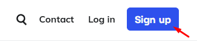

# InfinityFree

## InfinityFree es un hoost que te permite crear webs gratuitas

1- Primero de todo deberas registarte en la pagina de **InfinityFree** 

2- Despues iniciar sesion tendras que crear un dominio que para poder crear un dominio le daremos la boton mostrado.

3- Una vez ya dado este boton entraremos a un menu en el qual le tendremos que dar al boton marcado en la foto siguiente

4- Una vez ya dado el boton pondremos el nombre que queramos a nuestro dominio

5- Una vez ya creado entraremos a nuestra web para poder crearla 

6- En esta imagen se mostrara las diferentes cosas que deja hacer en nuestra pagina web

# Netlify

## Netlify es un hoosting que te permite alojar paginas web

1- Lo primero que tendremos que hacer en **Netlify** ser iniciar sesion.

2- Una vez ya verificado el correo tendras que reienar el siguiente formulario

3- Despues de reienar el formulario ya podremos hacer las distintas opciones que nos ofrece la pagina las cuales son estas:

# Award Space

## Es un servicio que ofrece crear distintas paginas web de forma gratuita 

1- Lo primero que aremos para poder empezar con el Award Space sera registarse

2- Una vez iniciada session tendremos que escojer la opcion de la izquierda como se muestra en la foto

3- Esta pagina nos permitira hacer todas las siguientes coas

# Free Hoosting

## Free Hoosting se puede crear y alojar paginas web de forma gratuita

1- Para poder iniciar sesion en **Free Hoosting** tendremos que darle al boton azul que sale arriba a la derecha como se muestra en la imagen

2- Despues tendremos que seleccionar nuestro dominio y disfrutar de la pagina 

